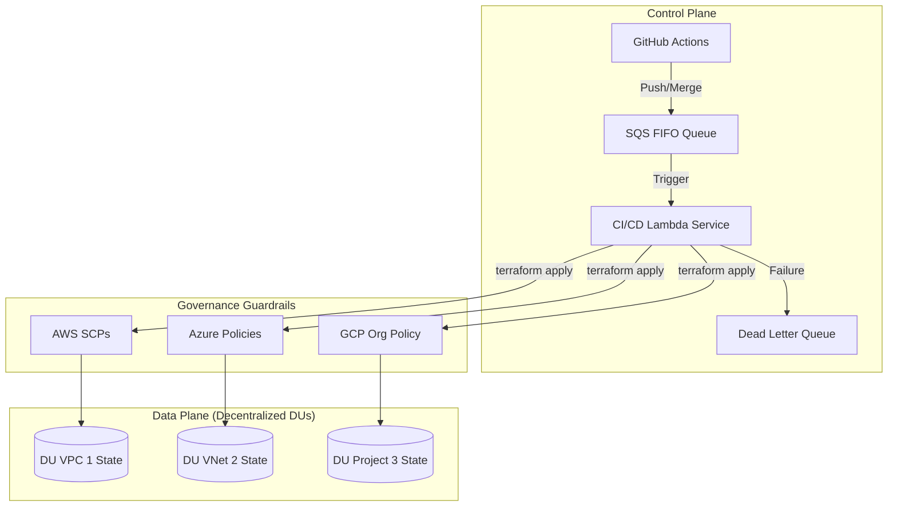

# Genesis: Multi-Cloud Platform Engine

Genesis is a **Day 0 Infrastructure-as-Platform (IaP)** framework for provisioning secure, observable, and production-ready foundations across AWS, GCP, and Azure. It utilizes a decentralized **Delivery Unit (DU)** model where infrastructure is treated as a set of governed microservices.

---

## 🏗 Platform Overview

Genesis implements a **Sovereign Engineering architecture** focused on:

- [cite_start]**Decentralized State**: Each DU/VPC manages its own independent state file to minimize blast radius. [cite: 1, 2]
- [cite_start]**Identity-First Security**: OIDC-based authentication (GitHub → Cloud) eliminates static secrets. [cite: 1]
- **Event-Driven CI/CD**: Resilient, sequential deployments via SQS FIFO and Lambda services.
- [cite_start]**Embedded Governance**: Multi-cloud federation with consistent policy enforcement via SCPs, Azure Policy, and GCP Org Constraints. [cite: 1, 3]

---

## 🧱 Architecture Model

Genesis is structured into three foundational layers:

### 1. Bootstrap (Trust Layer)
[cite_start]Initializes cloud foundations required for automation: [cite: 1, 2]
- [cite_start]OIDC identity federation. [cite: 1]
- [cite_start]Remote state backend initialization. [cite: 1]
- IAM Permission Boundaries for CI/CD Lambda runners.

### 2. Modules (Logic Layer)
[cite_start]Reusable, composable Terraform building blocks: [cite: 1, 2]
- [cite_start]**Governance**: Policy enforcement (Deny Public IP, Enforce Encryption, Tagging). [cite: 3, 4, 13]
- [cite_start]**Networking**: VPC / VNet / Shared VPC patterns per DU. [cite: 1]
- [cite_start]**Identity**: IAM / RBAC abstractions. [cite: 1]

### 3. CI/CD (Automation Service)
- **FIFO SQS**: Ensures deterministic, sequential execution per DU to prevent state drift.
- **Lambda Runner**: A serverless service that generates and executes Terraform plans.
- **DLQ**: Dead Letter Queue for failed compliance or infrastructure runs.

---

## 📂 Project Structure

```text
.
├── .github/workflows/   # CI/CD pipelines (OIDC-based deployments)
[cite_start]├── bootstrap/           # Cloud initialization (identity + state) [cite: 1]
[cite_start]├── modules/             # Reusable infrastructure components [cite: 1]
[cite_start]│   └── governance/      # Multi-cloud guardrails (AWS, Azure, GCP) [cite: 1, 3]
[cite_start]├── environments/        # DU-specific deployments (dev, staging, prod) [cite: 1]
[cite_start]├── apps/                # Cloud-specific application scaffolding [cite: 1]
[cite_start]└── Makefile             # Operational interface [cite: 1]
```

---

## 📊 System Flow



---

## 🏛 Embedded Governance Standards

All infrastructure must pass mandatory technical gates:

- [cite_start]**Network Security**: Deny Public IP exposure and public endpoints. [cite: 3, 4, 6]
- [cite_start]**Data Protection**: Enforce encryption-at-rest and secure transport (TLS). [cite: 1, 3]
- [cite_start]**Metadata Contract**: Mandatory tagging (`environment`, `owner`, `costCenter`, `application`) for cross-DU cost tracking. [cite: 13, 14, 15]

---

## 👤 Author

**Andres Arias** Senior Platform Engineer | Distributed Systems | Cloud Infrastructure