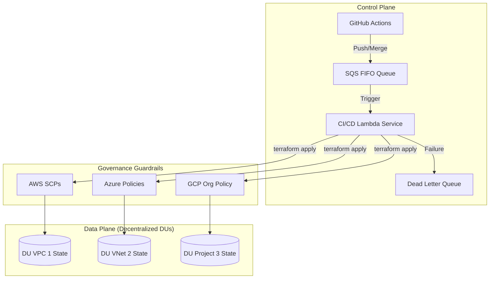

Here's your updated README with the **"Decentralized State (not copy-paste)"** section added:

---

# Genesis: Multi-Cloud Platform Engine

Genesis is a **Day 0 Infrastructure-as-Platform (IaP)** framework for provisioning secure, observable, and production-ready foundations across AWS, GCP, and Azure. It utilizes a decentralized **Delivery Unit (DU)** model where infrastructure is treated as a set of governed microservices.

---

## 🏗 Platform Overview

Genesis implements a **Sovereign Engineering architecture** focused on:

- **Decentralized State**: Each DU/VPC manages its own independent state file to minimize blast radius.
- **Identity-First Security**: OIDC-based authentication (GitHub → Cloud) eliminates static secrets.
- **Event-Driven CI/CD**: Resilient, sequential deployments via SQS FIFO and Lambda services.
- **Embedded Governance**: Multi-cloud federation with consistent policy enforcement via SCPs, Azure Policy, and GCP Org Constraints.

---

### Decentralized State (not copy-paste)

Genesis doesn't give you a copy of the state.  
It gives you an entirely **separate environment of state** — different bucket, different queue, different lock table.

You're never working on the same instance because there is no "same instance."

Each Delivery Unit gets its own environment of state:
- Isolated S3 backend (not a shared bucket)
- Separate DynamoDB lock table (no lock contention)
- Dedicated SQS FIFO queue (sequential per DU, parallel across DUs)

**This is not replication. This is separation.**

---

## 🧱 Architecture Model

Genesis is structured into three foundational layers:

### 1. Bootstrap (Trust Layer)
Initializes cloud foundations required for automation:
- OIDC identity federation.
- Remote state backend initialization.
- IAM Permission Boundaries for CI/CD Lambda runners.

### 2. Modules (Logic Layer)
Reusable, composable Terraform building blocks:
- **Governance**: Policy enforcement (Deny Public IP, Enforce Encryption, Tagging).
- **Networking**: VPC / VNet / Shared VPC patterns per DU.
- **Identity**: IAM / RBAC abstractions.

### 3. CI/CD (Automation Service)
- **FIFO SQS**: Ensures deterministic, sequential execution per DU to prevent state drift.
- **Lambda Runner**: A serverless service that generates and executes Terraform plans.
- **DLQ**: Dead Letter Queue for failed compliance or infrastructure runs.

---

## 📂 Project Structure

```text
.
├── .github/workflows/   # CI/CD pipelines (OIDC-based deployments)
├── bootstrap/           # Cloud initialization (identity + state)
├── modules/             # Reusable infrastructure components
│   └── governance/      # Multi-cloud guardrails (AWS, Azure, GCP)
├── environments/        # DU-specific deployments (dev, staging, prod)
├── apps/                # Cloud-specific application scaffolding
└── Makefile             # Operational interface
```

---

## 📊 System Flow



---

## 🏛 Embedded Governance Standards

All infrastructure must pass mandatory technical gates:

- **Network Security**: Deny Public IP exposure and public endpoints.
- **Data Protection**: Enforce encryption-at-rest and secure transport (TLS).
- **Metadata Contract**: Mandatory tagging (`environment`, `owner`, `costCenter`, `application`) for cross-DU cost tracking.

---

## 👤 Author

**Andres Arias** — Senior Platform Engineer | Distributed Systems | Cloud Infrastructure

---
