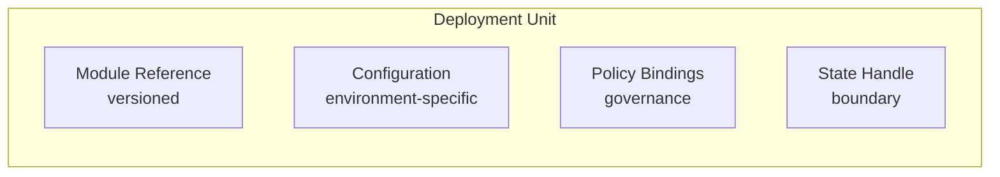
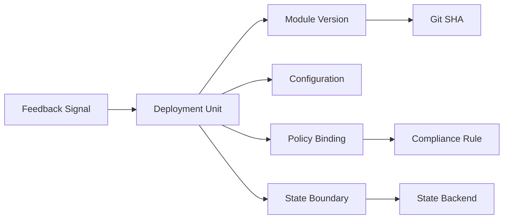
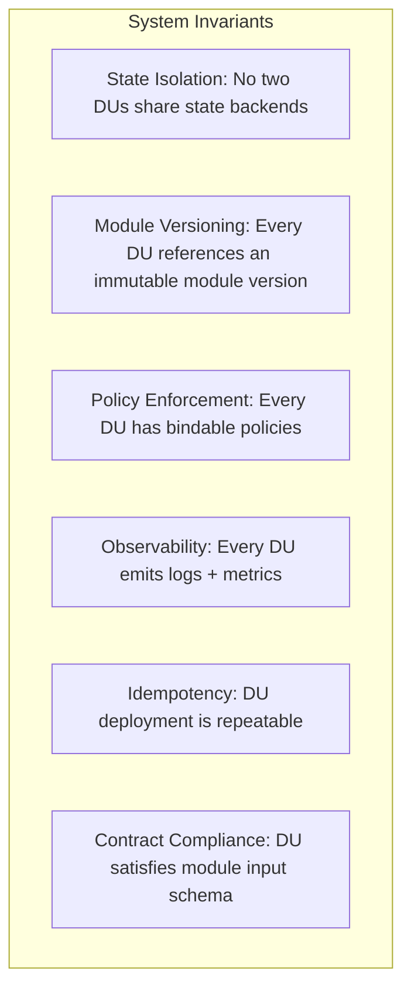
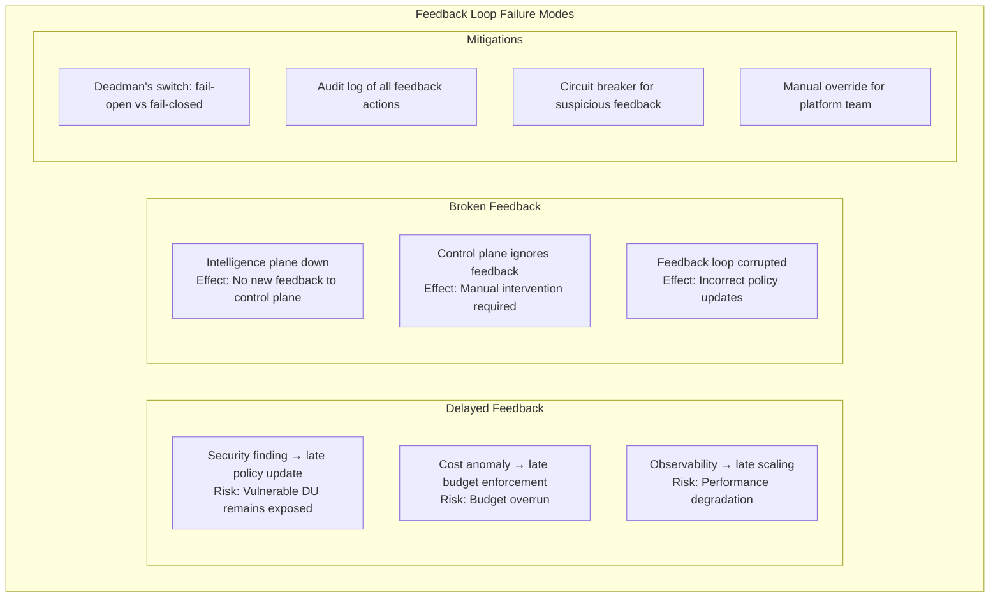
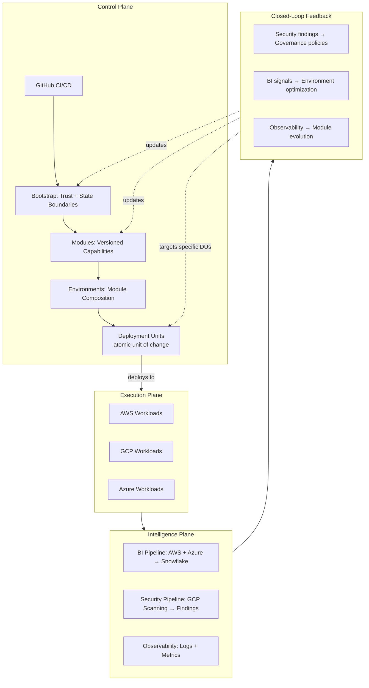
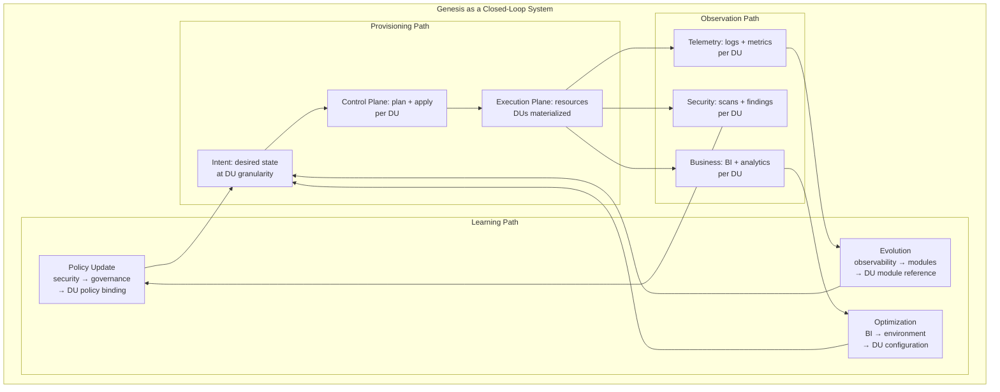
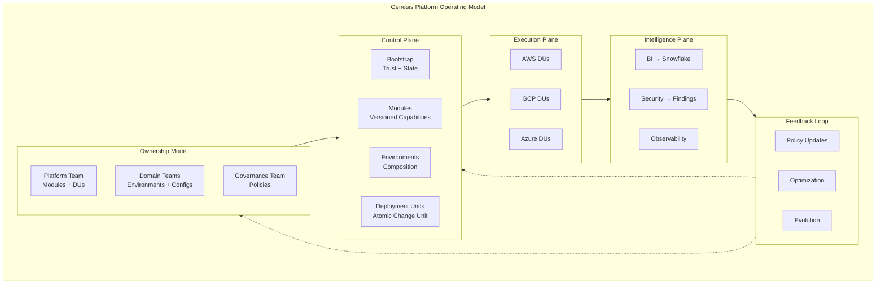
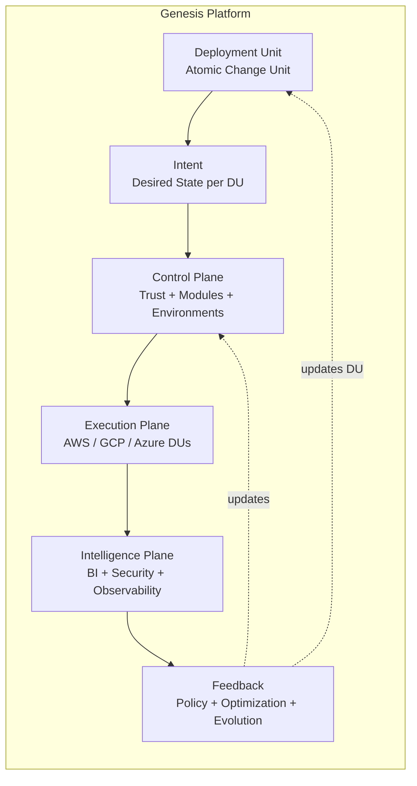

# Genesis: Platform Architecture

## The Core Insight

> **This is a contract-driven, multi-plane, federated cloud platform with closed-loop intelligence feedback.**

Not infrastructure as code. An **internal cloud platform operating system design.**

---

## 📦 The Atomic Unit: Deployment Unit

The fundamental unit of change in Genesis is the **Deployment Unit** (DU).

### Definition

A **Deployment Unit** is the smallest independently versionable, deployable, and observable component in the platform. It consists of:

| Component | Description |
|-----------|-------------|
| **Module Reference** | Points to a specific version of a capability module |
| **Configuration** | Environment-specific parameters (cidr, region, scale) |
| **Policy Bindings** | Governance rules applied to this unit |
| **State Handle** | Reference to isolated state boundary |

### Deployment Unit Properties

- **Versionable** - Can be rolled forward or backward independently
- **Testable** - Has defined validation contracts
- **Observable** - Emits telemetry to intelligence plane
- **Governable** - Policy can be enforced at unit boundary

### Examples

| Deployment Unit | Module | Configuration | State Boundary |
|-----------------|--------|---------------|----------------|
| cre-api-prod | AWS Networking v2.3.1 | us-east-1, /24 | aws/prod/cre-api |
| scan-worker-staging | GCP Compute v1.7.0 | n2-standard-4, 3x | gcp/staging/scan |
| risk-model-prod | Azure Identity v1.2.0 | entra-id, managed | azure/prod/risk |

---

## 🎯 End-to-End Traceability

With the Deployment Unit defined, every part of the system becomes traceable:

**Every change, observation, and feedback signal can be traced to a specific Deployment Unit.**

---

## 🔒 System Invariants

These conditions must **always** be true:

| Invariant | Description | Enforcement |
|-----------|-------------|-------------|
| **State Isolation** | No two DUs share state backends | Bootstrap layer enforces |
| **Module Versioning** | Every DU references immutable version | Module registry enforces |
| **Policy Enforcement** | Every DU has bindable policies | Governance module enforces |
| **Observability** | Every DU emits logs + metrics | Telemetry sidecar |
| **Idempotency** | DU deployment is repeatable | Terraform + state |
| **Contract Compliance** | DU satisfies module input schema | CI/CD validation |

---

## ⚠️ Failure Modes

What happens when the feedback loop is delayed or broken?

### Failure Response Matrix

| Failure | Detection | Mitigation | Recovery |
|---------|-----------|------------|----------|
| **Delayed security feedback** | Timestamp on findings | Falls back to last known good policy | Replay missed updates |
| **Intelligence plane down** | Health check on pipelines | Control plane uses cached policies | Restart pipeline |
| **Corrupted feedback** | Schema validation + anomaly detection | Circuit breaker engages | Manual review |
| **State boundary violation** | State backend audit | Deployment rejected | Reconcile states |

---

## 🧠 Platform Operating Model (Complete)

---

## 🔄 System Dynamics (Updated)

**The Deployment Unit is the traceable atom across provision → observe → learn → update.**

---

## 📊 Architecture Summary

---

## 🎯 Executive Summary

**Genesis is a federated multi-cloud platform operating model with:**

| Layer | Components | Key Characteristics |
|-------|------------|---------------------|
| **Control Plane** | Bootstrap, Modules, Environments, Deployment Units | Trust, state boundaries, versioned contracts, atomic change |
| **Execution Plane** | AWS, GCP, Azure workloads | Federated domains, independent operations |
| **Intelligence Plane** | BI, Security, Observability | Derived insights, analytics, alerts |
| **Feedback Loop** | Policy, Optimization, Evolution | Closed-loop governance, continuous improvement |
| **Ownership** | Platform, Domain, Governance teams | Clear role separation, accountability |
| **System Invariants** | State isolation, versioning, observability | Always-true conditions |
| **Failure Modes** | Delay, break, corruption | Mitigations + recovery |

**System behavior (per Deployment Unit):**

1. **Provision:** Control Plane defines and deploys intent at DU granularity
2. **Execute:** Execution Plane runs DU workloads
3. **Observe:** Intelligence Plane collects DU-level signals
4. **Learn:** Feedback transforms signals into DU updates
5. **Evolve:** Control Plane incorporates learning into DU definitions

**The Deployment Unit is the traceable atom across the entire loop.**

---

## 🔐 Design Principles

| Principle | Description |
|-----------|-------------|
| **Plane Separation** | Control, execution, intelligence are distinct |
| **Closed-Loop Governance** | Intelligence feeds back into control |
| **Contract-First** | Versioned, semantic contracts for all interfaces |
| **State Boundaries** | Isolated state per Deployment Unit |
| **Federation** | Each cloud owns its execution domain |
| **Zero-Secret** | OIDC replaces static credentials |
| **Ownership Clarity** | Platform, domain, and governance roles separated |
| **Deterministic** | Reproducible, idempotent deployments |
| **Invariants** | Always-true system conditions enforced |
| **Failure Tolerance** | Feedback loop delays and breaks are mitigated |

---

## 📌 The 60-Second Summary Diagram

**The Deployment Unit is the atom. The loop is the system. Invariants are the constraints.**

---

## What This Document Represents

| Aspect | Description |
|--------|-------------|
| **Not** | Terraform folder structure or infrastructure layout |
| **Is** | Closed-loop, contract-driven, multi-plane platform operating system model |
| **Atomic Unit** | Deployment Unit (module ref + config + policies + state handle) |
| **System Behavior** | Provision → Observe → Learn → Update (per DU) |
| **Invariants** | Always-true conditions enforced at every layer |
| **Failure Handling** | Mitigations for delayed or broken feedback |
